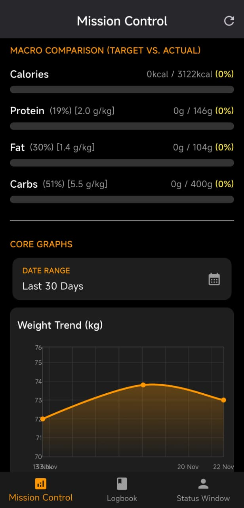
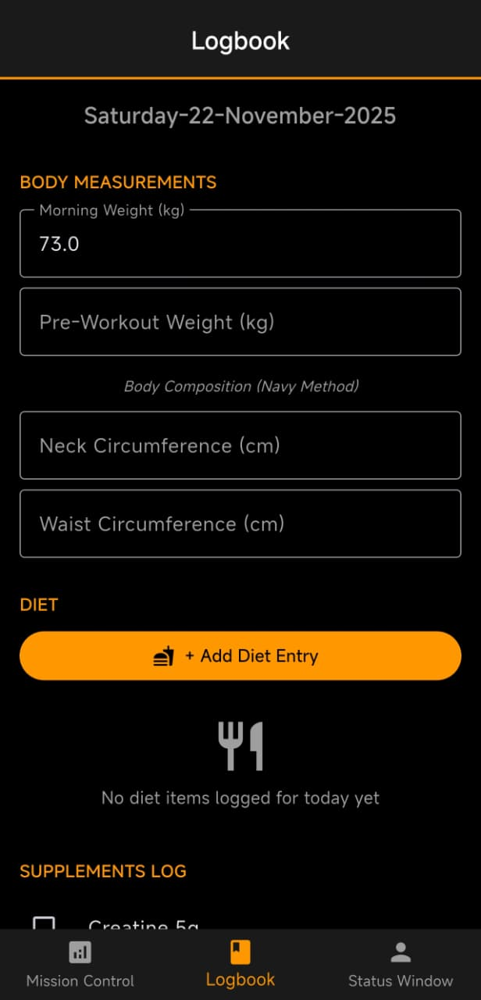
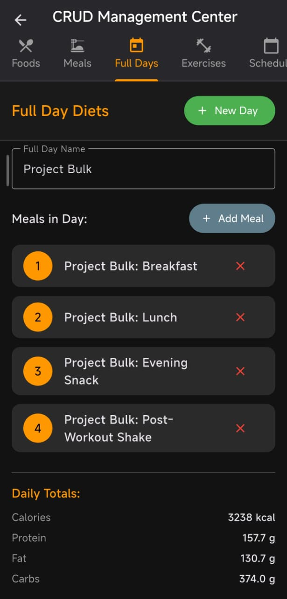

# Forge

A fully offline fitness & nutrition logbook built in Flutter — no account, no cloud, no subscription. Designed for the self-directed athlete who already has a plan and just wants a fast, private, powerful tool to track it.

> **Note:** This repository is a **showcase**. The full source is private — Forge is an active commercial project being prepared for store release. The screenshots, architecture, and formulas below reflect the real app.

---

## What It Does

Tracks workouts, nutrition, body composition, sleep, hydration, jogging, and supplements — entirely on-device. The standout is a **hierarchical food system**: create individual foods → combine them into meals → combine meals into full-day plans. Meal-prep the same Monday every week? Load your "Monday Plan" and the whole day logs at once.

It calculates **TDEE** (Mifflin-St Jeor, with selectable Harris-Benedict and Katch-McArdle formulas), tracks **body-fat %** via the **US Navy method**, derives macro targets from your goal, and visualizes everything across multiple trend graphs.


*Mission Control — today's macro progress and historical trends*


*Daily logging interface*

---

## Highlights

- **100% offline & private** — all data lives in a local SQLite database. No accounts, no servers, no tracking.
- **Verified math** — every formula (BMR/TDEE, Navy body-fat, macro split, pace, sleep) is covered by an automated unit-test suite asserting against independently hand-computed values.
- **Hierarchical diet system** — foods → meals → full-day plans, fully user-editable via a built-in CRUD center.
- **Reactive calculations** — TDEE, body-fat %, and macro targets recompute live as you type.
- **Workout tracking** — schedule-driven exercise auto-population, set logging, and a built-in stopwatch for timed holds; computes training volume and max-hold progression.
- **Trend analytics** — weight, macros, sleep, strength, jogging, steps, and body composition over custom date ranges.
- **Full data ownership** — complete JSON backup/restore plus per-table CSV export.


*Managing foods, meals, exercises, and schedule*

---

## Architecture

- **Flutter / Dart**, dark-theme, 3-tab navigation (Mission Control · Logbook · Status Window).
- **Drift** (type-safe SQLite) with a relational schema — master/config tables, daily logs, and junction tables for many-to-many relationships (meal compositions, full-day links, weekly schedule).
- **Single-responsibility structure** — schema, seeding, and queries are separated; all business math lives in a dedicated calculator class (no calculation logic in the UI).
- **Provider** for state; **fl_chart** for visualization; **path_provider** for local storage.
- **Safe migrations** — versioned schema with an upgrade path so data survives updates.

---

## The Formulas

**TDEE (Mifflin-St Jeor):**
```
Male:   BMR = (10 × weight_kg) + (6.25 × height_cm) − (5 × age) + 5
Female: BMR = (10 × weight_kg) + (6.25 × height_cm) − (5 × age) − 161
TDEE = BMR × Activity Factor (1.2 – 1.9, or a custom multiplier)
```
Also selectable: **Harris-Benedict** (revised) and **Katch-McArdle** (uses lean body mass from the Navy measurement).

**Body Fat % (US Navy, metric):**
```
Male:   BF% = 495 / (1.0324 − 0.19077·log10(waist − neck) + 0.15456·log10(height)) − 450
Female: BF% = 495 / (1.29579 − 0.35004·log10(waist + hip − neck) + 0.22100·log10(height)) − 450
```

**Macro targets:** protein from body weight, fat as a share of calories, carbohydrates as the remainder — clamped so an over-aggressive deficit can never produce negative carbs.

---

## Tech Stack

Flutter · Dart · Drift (SQLite) · Provider · fl_chart · path_provider — **no backend, no cloud services.**

---

## What This Project Demonstrates

- Designing a relational schema with proper foreign keys and junction tables.
- Implementing scientific formulas correctly and **locking them with automated tests**.
- Offline-first architecture with local persistence and full backup/restore.
- Reactive, real-time Flutter UIs and clean separation of concerns.
- Shipping a complete app end-to-end, solo.

---

## Contact

**Shobhit Bansal**
LinkedIn: [linkedin.com/in/shobhitbansal2002](https://linkedin.com/in/shobhitbansal2002)
Portfolio: [shobhitbansal2002.vercel.app](https://shobhitbansal2002.vercel.app)

---

Built with Flutter. Works completely offline. Designed for real-world daily use.
